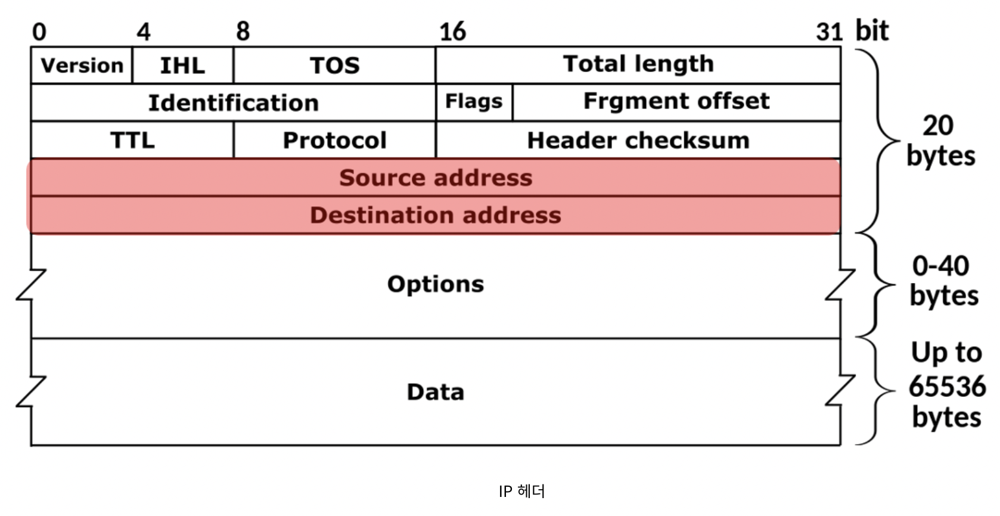
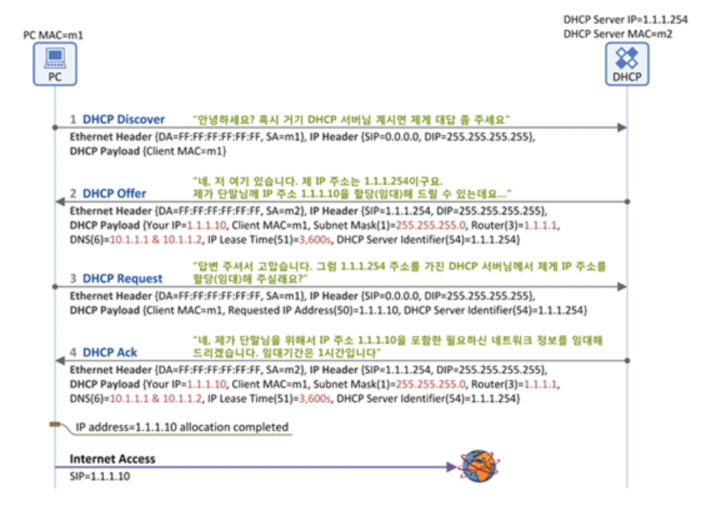

# <u>네트워크 계층(network-layer)</u>

***라우팅과 포워딩***

* 라우팅(Routing) : 어떤 네트워크 안에서 통신 데이터를 보낼 때 최적의 경로를 선택하는 과정.

* 포워딩(Forwarding) : 포워딩 테이블에 적힌 목적지 주소에 대응된 출력 포트로 패킷을 이동시키는 작업을 말한다.
    * Longest prefix matching : 매치가 되는 것들중에 가장 길게 매치되는 것들을 기준으로 나누는 법

---
***IP protocol 구조***

  

* version : IP version
* TTL(time to live) : 라우터의 갯수 제한 -> 데이터을 전달할 수 없는 것으로 판단되어 소멸되기 이전에 데이터가 이동할 수 있는 단계의 수
* upper-layer : TCP or UDP 인지 알려주기 위해
* fragment offset : 8바이트 오프셋으로 조각에 저장된 원래 데이터의 바이트 범위를 나타낸다.
* source address : 출발지 IP 주소 (32bits)
* destination address : 목적지 IP 주소 (32bits)

---
***IP Address(32bits)***

* 네트워크 부(24bits)
    * 네트워크 식별
    * 라우터가 라우할 때 식별
    * IP 주소 할당 기관에서 할당

* 호스트 부(8bits)
    * 호스트 식별
    * 네트워크 관리자가 식별

---
***서브넷팅과 서브넷***
대규모 네트워크를 좀 더 작은 네트워크로 분할하는 것을 서브넷팅(Subnetting)이라 하고, 분할된 네트워크를 서브넷(Subnet)이라고 합니다.
---

***NAT(Network Address Translation)***

* IPv4의 주소 부족 문제를 해결하기 위한 방법
* IP 패킷의 TCP/UDP 포트 숫자와 소스 및 목적지의 IP 주소 등을 재기록하면서 라우터를 통해 네트워크 트래픽을 주고 받는 기술을 말합니다.
* NAT를 이용하는 이유는 대개 사설 네트워크에 속한 여러 개의 호스트가 하나의 공인 IP 주소를 사용하여 인터넷에 접속하기 위함입니다.

---
***DHCP (Dynamic Host Configuration Protocol)***

* DHCP란 호스트의 IP주소와 각종 TCP/IP 프로토콜의 기본 설정을 클라이언트에게 자동적으로 제공해주는 프로토콜을 말합니다.
* IP 설정이 자동으로 되기 때문에 효율적으로 사용 가능하고, IP를 자동으로 할당해주기 때문에 IP 충돌을 막을 수 있습니다.
* server -> 67, client -> 68
* DHCP의 원리
    * DHCP 서버가 IP 주소를 영구적으로 단말에 할당하는 것이 아니고 임대기간(IP Lease Time)을 명시하여 그 기간 동안만 단말이 IP 주소를 사용하도록 하는 것입니다.
  

      
  

---
***ICMP(Internet Control Message Protocol)***

* ICMP는 TCP/IP에서 IP 패킷을 처리할 때 발생되는 문제를 알려주는 프로토콜이다.

---
***Routing Algorithm***

* Link state routing
    * 각 라우터는 주변의 링크들을 탐색하고 연결된 라우터의 주소를 알아냅니다. 그리고 각 링크의 가중치(cost)를 측정합니다. 이후 각 링크와 가중치에 대한 정보를 담은 패킷을 만듭니다. 이렇게 만들어진
      LSP(Link State Packet)를 모든 라우터에게 보냅니다. 마지막으로 다른 라우터로부터 받은 LSP들을 이용하여 각 라우터로의 가장 짧은 경로를 계산합니다.
* Distance vector routing
    * 먼저 모든 링크의 가중치(cost)는 이미 알려져 있다고 가정합니다. (가중치는 링크에 연결되어 있는 라우터가 측정할 수 있습니다.) 각 라우터는 라우팅 테이블을 가지고 있고, 이 테이블에는 주어진
      서브넷의 모든 라우터에 대한 정보를 가집니다. 각 라우터에 대한 정보는 해당 라우터까지의 거리와 그 라우터로 가기 위한 값입니다. 각 라우터는 현재의 라우팅 테이블 정보를 이웃에게 보냅니다.

[Routing Algorithm 관련 더보기](https://doorbw.tistory.com/52)
---
