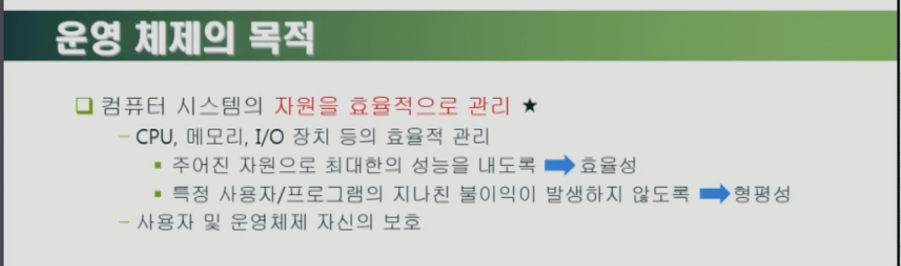
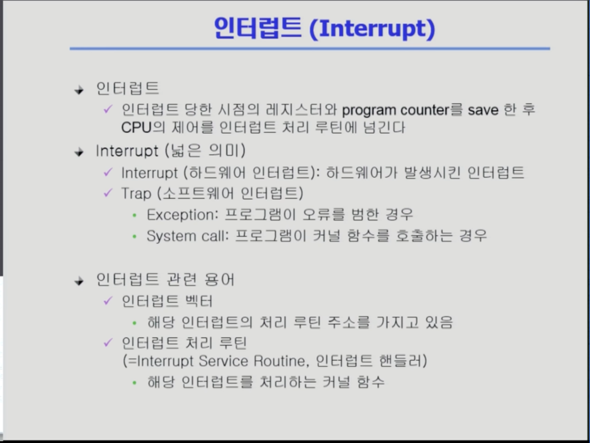
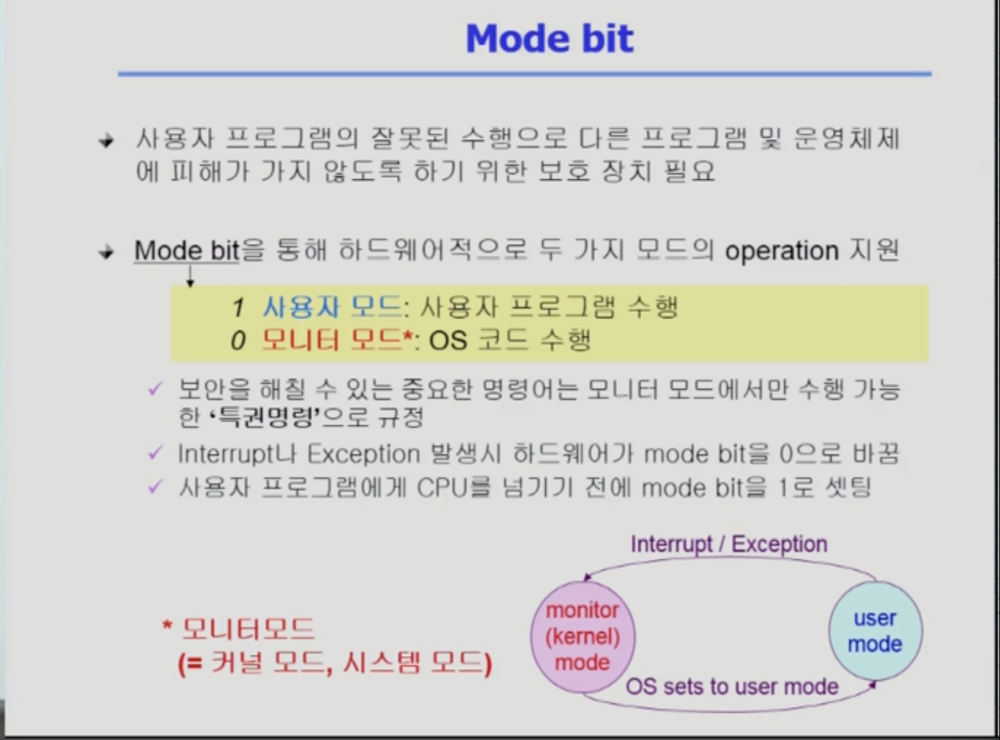

 # <u>운영체제란</u>

운영 체제(Operating System, OS)는 컴퓨터를 제어하고 관리하기 위한 소프트웨어 시스템입니다. 운영 체제는 컴퓨터의 하드웨어를 관리하고, 입력과 출력 장치, 저장 장치, 컴퓨터 내부의 자원 등을 제어합니다.

운영 체제는 컴퓨터 시스템을 사용할 수 있게 해주는 기본 소프트웨어이기도 합니다. 운영 체제는 컴퓨터 시스템에서 수행되는 각종 작업을 제어하고, 입력과 출력 장치, 저장 장치, 컴퓨터 내부의 자원을 제어합니다. 운영 체제는 컴퓨터 시스템을 사용하는 사람과 컴퓨터 시스템 자체 사이의 인터페이스 역할을 합니다.

운영 체제는 컴퓨터 시스템을 제어하기 위한 기능과 서비스를 제공합니다. 이러한 기능과 서비스는 운영 체제의 커널(Kernel)에 구현되어 있습니다.

***시스템 호출(System Call)***

시스템 호출(System Call)은 운영 체제의 커널과 유저 모드 프로그램간의 인터페이스를 제공하는 기능입니다. 시스템 호출은 운영 체제가 제공하는 서비스를 유저 모드 프로그램에서 접근할 수 있게 해줍니다.

운영 체제 커널은 시스템 자원을 관리하고, 입출력 장치를 제어하고, 프로세스 관리를 수행하는 등 다양한 역할을 수행합니다. 이러한 커널 서비스를 유저 모드 프로그램에서 접근할 수 있게 하기 위해서는 시스템 호출을 사용합니다.

***인터럽트란(Interrupt)***

인터럽트는 컴퓨터 시스템에서 외부 입력과 출력 장치, 소프트웨어 프로그램 등에서 컴퓨터 시스템에게 처리해야 할 요청을 전달하는 기능입니다. 인터럽트는 컴퓨터 시스템에서 수행 중인 작업을 일시 중지하고, 요청을 처리한 후 작업을 다시 진행하는 기능을 가지고 있습니다.

인터럽트는 컴퓨터 시스템이 요청을 처리하는데 필요한 정보를 전달하기 위해 인터럽트 레지스터(Interrupt Register)를 사용합니다. 인터럽트 레지스터에는 인터럽트가 발생한 장치의 정보가 저장되어 있습니다.

***이중 연산 모드***
적어도 두 개의 독립된 연산 모드, 즉 사용자 모드와 커널모드를 필요로 한다. <u>모드 비트(mode bit)</u>라고  하는 하나의 비트가 현재의 모드를 나타내기 위해 컴퓨터의 하드웨어에 추가되었다. 커널모드 -> 0, 사용자 모드 -> 1을 나타낸다.

***타이머***

운영체제가 CPU에 대한 제어를 유지할 수 있도록 보장해야한다. 프로그램이 무한 루프에 빠지거나 시스템 서비스 호출이 실패하여 제어가 운영 체제로 복귀하지 않는 경우를 방지하기위해 운영체제 타이머는 운영체제가 제공하는 시계 인터럽트(clock interrupt)를 이용해 정해진 시간 간격마다 실행됩니다.

***캐싱***

캐싱(caching)은 컴퓨터 시스템에서 정보를 임시로 저장하고 관리하는 기술을 의미합니다. 캐싱을 사용하면 정보를 저장할 필요가 없을 정도로 자주 접근하는 경우, 이를 캐싱해두면 접근 속도가 빠르게 처리될 수 있습니다. 캐싱은 컴퓨터 시스템의 성능을 향상시키기 위해 사용되며, 인터넷 브라우저에서 캐싱을 사용하면 웹 페이지를 자주 접근할 경우 웹 페이지를 캐싱해두고 접근 속도를 개선할 수 있습니다.

캐싱은 컴퓨터 시스템에서 캐시(cache)라고도 하며, 캐시는 컴퓨터 시스템의 저장 장치를 의미한다. 먼저 캐시에 정보가 있는지 조사하여 캐시에 있으면 정보를 캐시로부터 직접사용하고, 캐시가 없다면 주 메모리로 시스템으로부터 그 정보를 가져와서 사용한다.