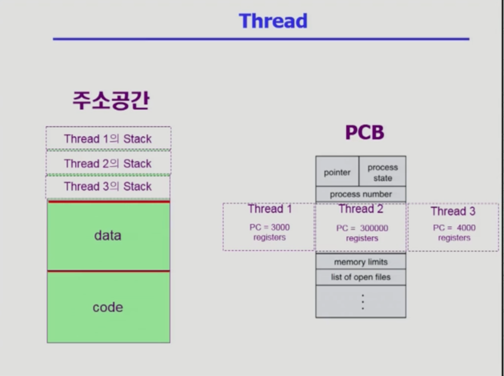

# <u>스레드란</u>

스레드(thread)는 컴퓨터 프로그램에서 실행할 수 있는 작은 실행 단위를 의미합니다. 스레드는 하나의 프로세스 안에서 실행되며, 프로세스 내에서 스레드들은 같은 주소 공간을 공유하고 있습니다. 스레드는 운영
체제가 관리하는 것이 일반적으로 일련의 커널 자원을 사용하기 때문에, 스레드는 운영 체제의 지원을 기반으로 구현됩니다.

```그렇다면 스레드는 왜 쓸까?```

1. 메모리 절약

- OS마다 다르지만, 무슨 작업을 수행하려고 할 때 JVM은 적어도 32~64MB 물리 메모리 점유한다. 근데 스레드는 1MB 이내의 메모리만 점유한다. 그래서 스레드를 '경량 프로세스'라고도 부른다.

2. 프로세스 콘텍스트 스위칭(Context Switching)에 비해 오버헤드 절감

- 멀티 프로세스로 실행되는 작업을 멀티 스레드로 실행하게 되면 프로세스를 생성하여 자원을 할당하는 과정도 줄어들뿐더러 프로세스를 콘텍스트 스위칭(Context Switching)하는 것보다 오버헤드를 더 줄일 수
  있게 된다.

3. 작업들 간 통신 비용 절감

- 프로세스 간의 통신 비용보다 하나의 프로세스 내에서 여러 스레드 간의 통신 비용이 훨씬 적으므로 작업들 간의 통신 부담을 줄일 수 있게 된다.

***스레드의 장점***

* 응답성이 빠르다.
* 자원을 공유하는데서오는 효율
* 오버헤드가 적다.
* 병렬성을 추구할수있다. -> 더 빠름

---

***병행(Concurrency)과 병렬(Parallelism)의 차이***

병렬: 하나 이상의 태스크를 동시에 수행할 수 있는 시스템에 대해 병렬적이라고 말한다.

병행: 물리적인 상황을 극복하기 위해서 소프트웨어적으로 작업을 번갈아가며 수행하게 함으로서 여러 프로세스를 교차 수행한다.

---
***Thread***

* Thread의 구성
    * program counter(PC)
    * register set
    * stack space

* Thread가 동료 thread와 공유하는 부분
    * code section
    * data section
    * OS resources



